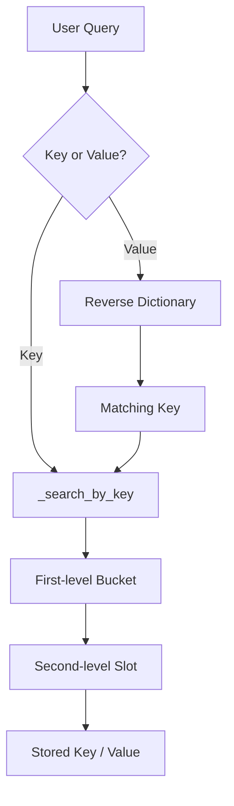

# SAI Search Algorithm

<p align="center">
  
  
  
</p>

<p align="center"><strong>A two-level hashing based search system created by P. Siva Sai</strong></p>

> **Note:** The repository's executable implementation is Python. The older README described a Java HashMap example; the current code is the SAI Search implementation in `SAI_Search_Algorithm.py` plus a Streamlit interface in `app.py`.

## 📌 Overview

The project contains two connected parts:

1. **SAI Search Algorithm** — the core `SAISearch` class.
2. **Streamlit Search Application** — an interactive UI for loading CSV data and searching it.

The repository also includes `Reasearch_Paper_Topic.MD`, which documents the research motivation, two-level hashing design, theoretical complexity claims, and an ASCII architecture diagram.

## 🧠 Core Algorithm

The implementation in `SAI_Search_Algorithm.py` follows this flow:

```text
Input Key
    │
    ▼
SHA-256(secret + key)
    │
    ▼
Integer key transform
    │
    ▼
First-level hash → Bucket
    │
    ▼
Second-level hash → Slot
    │
    ▼
Stored (key, value) pair
```

### 🔐 Key transformation

The code converts each key to bytes and hashes it using `SHA-256(secret + key)`. The secret is generated with Python's `secrets.token_bytes(16)` when one is not supplied.

### 🪣 First-level hashing

Keys are assigned to buckets using parameters `a1`, `b1`, prime modulus `P = 2^61 - 1`, and the number of buckets `m`.

### ⚡ Second-level hashing

For a bucket containing `b` records, the implementation allocates a table of size `b²` and keeps generating second-level hash parameters until the keys in that bucket occupy distinct slots.

### 🔎 Lookup

`search(q)` first searches for `q` as a key. If that fails, it checks the reverse dictionary for a matching value and searches using the first associated key.

## 🏗️ Search Architecture



This diagram is derived from the current `SAISearch.search()` and `_search_by_key()` implementation.

## 🖥️ Streamlit Application

The UI in `app.py` is configured as a wide Streamlit application titled **🔎 SAI Search Algorithm** with the caption **Searching Algorithm by P. Siva Sai**.

### UI flow

```text
GitHub CSV / Upload CSV
          │
          ▼
   pandas DataFrame
          │
          ▼
     CSV Preview
          │
          ▼
SAISearch.add_input()
          │
          ▼
     SAISearch.build()
          │
          ▼
   Search key/value
       /        \
    Found      Not found
      │            │
      ▼            ▼
   Success       Warning
```

### 📂 CSV input

The current application supports:

- **GitHub CSV** — discovers `.csv` files from the repository tree and loads the selected file from its raw GitHub URL.
- **Upload CSV** — accepts a local CSV upload through Streamlit.

For each dataset, the first CSV column becomes the search key and the second column becomes the value. The app previews the DataFrame before searching.

### ✅ Search result

The UI shows `✅ Your search is found` when a result exists and `No result found.` when there is no match.

## 🧩 Repository Structure

| File | Purpose |
|---|---|
| `SAI_Search_Algorithm.py` | Core `SAISearch` algorithm and command-line mode |
| `app.py` | Streamlit UI, CSV loading, preview and search |
| `requirements.txt` | Streamlit and pandas dependencies |
| `Reasearch_Paper_Topic.MD` | Research note and algorithm diagram |
| `New_README.md` | Earlier README draft |

## 📈 Complexity

The research note describes the design as a worst-case O(1) perfect-hashing search system. The current Python implementation separates build time from lookup time.

| Operation | Project behavior |
|---|---|
| Add input | Appends key/value before build |
| Build | Creates first- and second-level tables |
| Key lookup | Fixed sequence of hashing/index operations after build |
| Value lookup | Reverse Python dictionary lookup, then key lookup |
| Storage | Secondary tables plus reverse mapping |

> The complexity and security statements here are presented as the project's documented research design, not as an independent benchmark or formal verification.

## 🧪 Command-Line Mode

Running the core Python file directly keeps the original command-line flow:

```bash
python SAI_Search_Algorithm.py
```

Example:

```text
Your Using SAI Search Algorithm by P. Siva Sai
How many key-value pairs: 3
Enter key: A
Enter value: APPLE
Enter key: B
Enter value: BANANA
Enter key: C
Enter value: CHERRY
Search key or value (or 'exit'): B
Your search is found: BANANA
Search key or value (or 'exit'): BANANA
Your search is found: APPLE
Search key or value (or 'exit'): exit
```

## ▶️ Run the Streamlit App

```bash
git clone https://github.com/pallasivasai/Searching_Algorithm_By_Me.git
cd Searching_Algorithm_By_Me
pip install -r requirements.txt
streamlit run app.py
```

Current dependencies:

```text
streamlit>=1.40
pandas>=2.0
```

## 🖼️ Visuals from the Current Code

The repository currently does **not** contain PNG/JPG application screenshots or other UI image assets. So this README uses architecture and UI-flow diagrams derived directly from the current Python code instead of adding a fake screenshot.

## 📚 Research Reference

**[Reasearch_Paper_Topic.MD →](https://github.com/pallasivasai/Searching_Algorithm_By_Me/blob/main/Reasearch_Paper_Topic.MD)**

The research note documents secure key transformation using SHA-256 + secret, first-level hashing, second-level perfect hashing, reverse value lookup, complexity analysis, the security model, example applications, and the research architecture diagram.

## 🔗 Links

- **GitHub Repository:** https://github.com/pallasivasai/Searching_Algorithm_By_Me
- **Core Algorithm:** https://github.com/pallasivasai/Searching_Algorithm_By_Me/blob/main/SAI_Search_Algorithm.py
- **Streamlit App:** https://github.com/pallasivasai/Searching_Algorithm_By_Me/blob/main/app.py
- **Research Note:** https://github.com/pallasivasai/Searching_Algorithm_By_Me/blob/main/Reasearch_Paper_Topic.MD